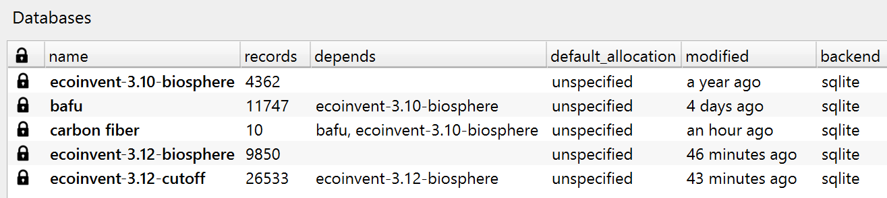

# AB-01 Activity Browser Part I Handout

Instructor: Bernhard Steubing

## Purpose

This handout supports the first Activity Browser module after the `ecoinvent 3.12 cutoff` import.
The focus is on advanced analysis features rather than on notebook work.

## Before you start

- Activate the `lca-course` environment.
```bash
conda activate lca-course
```
- Open Activity Browser from the same environment.
```bash
activity-browser
```
- Select the Brightway project `paris-lca-course-2026`.
- Confirm that both the Day 1 BAFU database and `ecoinvent-3.12-cutoff` are visible.


## Module goals
- Learn:
  - **core AB skills**: manage projects and databases, inventory modeling, LCA calculations 
  - **advanced AB skills**: modeling with multifunctional processes, parameters, uncertainties, and GSA


## Detailed schedule

### Core AB skills

- **Basic inventory modeling** (30 min, 13-13.30)
    - Chapters: Projects, Databases, Inventory Modeling
    - Live demo: projects, databases, inventory modeling
    - Exercise: "Fuel electricity" (stop before creating the LCA Setup). 


- **LCA setups and LCA results** (30 min, 13.30-14)
    - Live demo: walk through the LCA results tabs (electricity DE/FR)
    - Exercise: Finish "Fuel electricity". Go through all LCA Results tabs. 
    - Exercise: Analyze LCA Results for a couple of products of your choice. Use contribution analysis and the Sankey tab. Also inspect the lifecycle inventory.

### Advanced AB skills

- **Multifunctional processes** (30 min, 14-14.30)
  - Chapters: Multifunctional processes
  - Live demo: creating co-production/recycling/co-treatment processes; allocation & substitution
  - Exercise: Create a co-production, recycling, and co-treatment process. Add "carbon dioxide, fossil" as environmental flow. Play with allocation and calculate LCA results.


- _Coffee break_ (14.30-15)


- **Parameters** (30 min, 15-15.30)
  - Chapters: Parameters
  - Live demo: Heat pump parameterization
  - Exercise: "Heat pump, parameterized". Play with the model; how do COP (efficiency), lifetime, and electricity source influence LCA results?


- **Uncertainties** (30 min, 15.30-16)
  - Chapters: Uncertainties and Monte Carlo
  - Live demo: viewing & adding uncertainty data; conducting Monte Carlo Analysis
  - Exercise: add uncertainties to your model; conduct Monte Carlo


- **Global Sensitivity Analysis** (30 min, 16-16.30)
  - Live demo: Performing GSA
  - Exercise: find the most important uncertainties in your system or a Bafu / ecoinvent process of your choice

## Resources
Additional reading material and exercises will be provided during the course. 